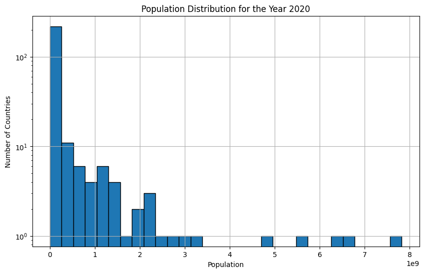

# Data Science Task 1: Histogram Analysis

This project involves the analysis of population data using histograms. The analysis includes visualizing population distributions for specific years and countries, and comparing population growth over a period of time.

## Loading the Dataset

The dataset is loaded from a CSV file, and initial exploration steps are taken to understand its structure.

## Population Distribution for the Year 2020

A histogram is created to visualize the population distribution for the year 2020.

**Inference**:
- The histogram of the population for 2020 shows that most countries have a population of fewer than 100 million people.
- The y-axis is on a logarithmic scale to accommodate the wide range of population values, indicating significant variation between countries.
- A few countries have very high populations, which are outliers on the right side of the histogram.

## Population Distribution for a Selected Year Range (2000-2020) for India

We analyze the population distribution in India from the year 2000 to 2020.

.png)

**Inference**:
- The population of India has steadily increased over the period from 2000 to 2020.
- The histogram indicates consistent growth, with population values distributed across the range, showing no sudden spikes or drops.
- This suggests a stable and continuous population growth trend in India over the two decades.

## Comparative Analysis of Population Distribution and Growth

We further compare the population distribution for the year 2023 and 2000, and analyze the population growth from 1960 to 2023.

.png)

**Inference**:
- **Population Distribution in 2023**: The histogram for 2023 shows a wide distribution of population values across countries, similar to the 2020 histogram. The majority of countries still have populations under 100 million, but there are more countries with higher populations compared to 2000.
- **Population Growth from 1960 to 2023**: The histogram of population growth indicates that most countries have experienced population growth, with a significant number showing substantial increases. This highlights global population growth trends over the past 60 years.
- **Population Distribution in 2000**: The 2000 histogram shows fewer countries with high populations compared to 2023, indicating a general increase in populations over time.

## Summary

This analysis provides insights into global population trends using histograms. The visualizations reveal how populations have changed over time and highlight significant trends in specific countries, such as India. By comparing different years and analyzing growth, we can better understand the dynamics of population changes worldwide.

---

This README provides a comprehensive overview of the tasks performed in the notebook, including the code implementation and key inferences drawn from the analysis.
